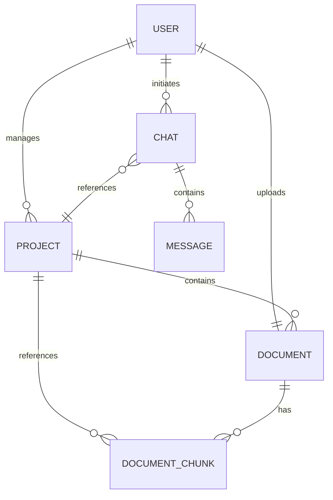
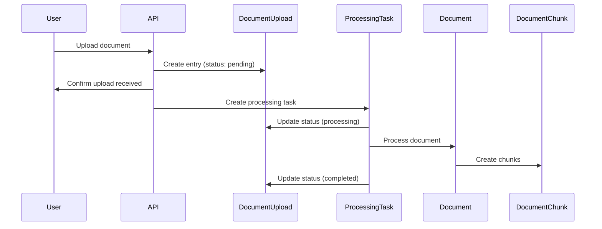
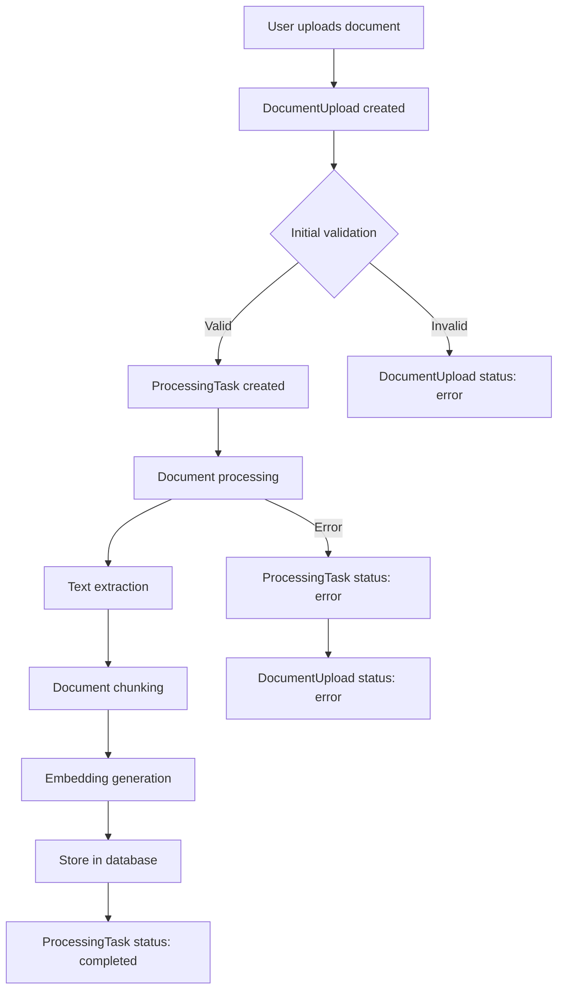

# Document Chat System Architecture

This document provides an overview of the RAG (Retrieval-Augmented Generation) system architecture and explains how the document processing task queue works.

## System Overview

The system is a Retrieval-Augmented Generation (RAG) application that allows users to:

1. Create and manage projects
2. Upload and process documents
3. Chat with an AI assistant using the uploaded documents as context
4. Manage permissions across different projects

## Database Schema and Relationships

The system is built on a robust relational database model with the following key entities:

### Core Entities

### Key Entity Descriptions

- **User**: Authentication and user management
- **Project**: Container for documents and chats within a specific knowledge domain
- **Document**: Represents an uploaded file with metadata
- **DocumentChunk**: Smaller segments of documents used for retrieval
- **Chat**: Conversation session between a user and the AI
- **Message**: Individual messages within a chat
- **Permission**: Access controls for different actions
- **ProjectPermission**: User permissions for specific projects

## Document Processing Workflow

The system implements a robust document processing pipeline to handle document uploads, processing, and chunking for RAG applications.

### Document Upload and Processing Flow

## Task Queue Architecture

The document processing task queue is implemented using the following models:

### Document Processing Pipeline

## Models in Detail

### DocumentUpload

The `DocumentUpload` model represents the initial file upload and tracks its processing status:

- **Status**: pending → processing → completed/error
- **Fields**: project_id, file_name, file_hash, file_size, content_type, temp_path
- **Relationships**: Links to Project, User, and ProcessingTask

### ProcessingTask

The `ProcessingTask` model represents an asynchronous processing job for document handling:

- **Status**: pending → processing → completed/error
- **Fields**: project_id, document_id, status, error_message
- **Relationships**: Links to DocumentUpload, Document, and Project

### Document

The `Document` model represents a successfully processed document:

- **Fields**: file_path, file_name, project_id, uploaded_by
- **Relationships**: Links to User, Project, DocumentChunks
- **Document Types**:
  - **Stakeholder**: Documents that define project stakeholders, their roles, responsibilities, and contact information
  - **Requirements**: Documents that specify functional and non-functional requirements for the project
  - **Core Objective**: Documents that outline the main goals, mission statements, and strategic objective
  - **UI Story Board**: 

### DocumentChunk

The `DocumentChunk` model represents the individual searchable segments of a document:

- **Fields**: id (unique chunk identifier), project_id, document_id, hash, chunk_metadata (contains embedding vector)
- **Relationships**: Links to Document and Project

## Typical RAG Workflow

1. **Document Upload**: User uploads a document to a project
2. **Processing Queue**:
   - Document is validated and a DocumentUpload record is created
   - A ProcessingTask is created to handle the asynchronous processing
   - The document is processed (text extraction, chunking, embedding)
   - Chunks are stored with their embeddings for retrieval
3. **Chat and Retrieval**:
   - User asks a question in a chat
   - System retrieves relevant document chunks based on semantic similarity
   - Retrieved context is combined with the question and sent to LLM
   - LLM generates an answer with citations from the source documents
4. **Response Rendering**: The answer is displayed with proper citations and references

## Permission System

The system includes a comprehensive permission model:

- System-level permissions for admin functions
- Project-level permissions for fine-grained access control
- Permissions include: view_project, edit_project, add_document, delete_document, etc.

This allows organizations to implement appropriate access controls for their document knowledge bases.
