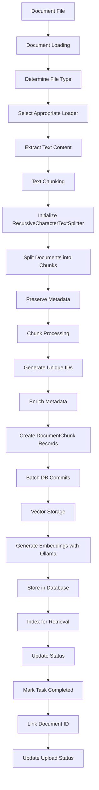

# Document Chunking Process

## Detailed Step-by-Step Process

### 1. Document Loading Phase

1. **Determine Document Type**: Examines file extension (`.pdf`, `.docx`, `.md`, etc.)
2. **Select Appropriate Loader**: Chooses the right loader based on file type.
   - Currently supports PDF, DOCX, DOC, TXT, MD, XLS, XLSX formats
3. **Content Extraction**: Loads the document using the selected loader, which:
   - Extracts text from the document
   - Preserves basic structure information (pages, sections)
   - Handles document-specific formatting

### 2. Chunking Phase

1. **Initialize Text Splitter**:
   - `chunk_size`: Controls maximum chunk size (default: 1000 characters)
   - `chunk_overlap`: Controls overlap between chunks (default: 200 characters)
2. **Document Splitting**: Applies the splitter to the loaded documents
   - Recursively splits text at natural boundaries (paragraphs, sentences)
   - Maintains specified chunk size constraints
   - Creates overlap between chunks for context preservation
3. **Chunk Metadata**: Each chunk contains:
   - `page_content`: The actual text content
   - `metadata`: Original document metadata plus page numbers

### 3. Chunk Processing & Storage

1. **Chunk ID Generation**: Creates unique identifier for each chunk:
   - Uses SHA-256 hash of combination of project ID, filename, and chunk content
2. **Metadata Enrichment**: Adds additional metadata to each chunk:
   - `source`: Original filename
   - `project_id`: Project identifier
   - `document_id`: Database ID of the document
   - `id`: Generated unique identifier (chunk_id)
3. **Database Storage**: Creates `DocumentChunk` records with:
   - Unique chunk ID as primary key
   - Document ID reference
   - Project ID
   - Filename
   - Hash for deduplication/comparison
   - Complete metadata including content in the chunk_metadata JSON field
4. **Batch Processing**: Commits to database in batches to avoid transaction issues

### 4. Vector Store Integration

1. **Vector Embedding**: Creates and stores vector embeddings:
   - Processes all chunks with the embedding model (using Ollama embeddings service)
   - Creates vector representations of each chunk
   - Stores vectors in the chunk_metadata JSON field
   - Associates vector embeddings with chunk IDs for efficient retrieval

### 5. Status Tracking

1. **Processing Status Updates**:
   - Updates the `ProcessingTask` status from "processing" to "completed"
   - Updates the associated `DocumentUpload` status
   - Records any errors during processing in the error_message field
2. **Cleanup**:
   - Removes temporary files after successful processing
   - Updates task timestamps for tracking processing time

## Mermaid Flowchart

## Document Processing Flow

In our implementation, the document processing follows this sequence:

1. User uploads document via the `/api/document/upload` endpoint
2. Document is validated and a `DocumentUpload` record is created with status "pending"
3. A `ProcessingTask` is created and background processing begins asynchronously
4. The document is processed into chunks using the technique described above
5. Vector embeddings are generated for each chunk
6. Chunks with embeddings are stored in the database
7. The processing status is updated to "completed"
8. The document is now ready for retrieval in RAG queries
