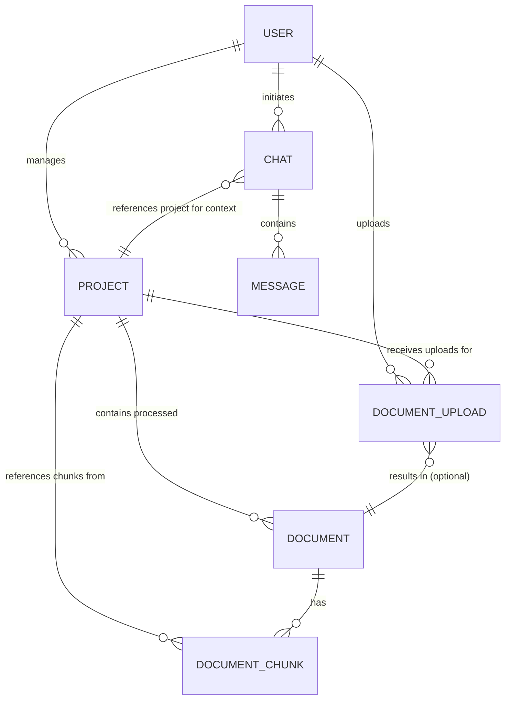
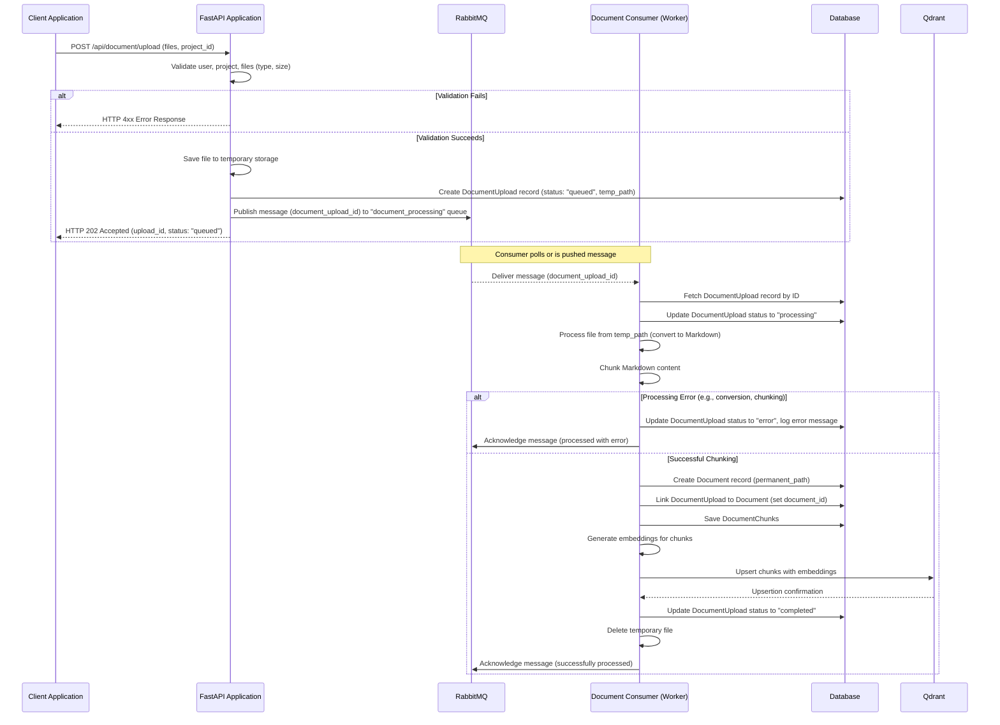

# Document Chat System Architecture

This document provides an overview of the RAG (Retrieval-Augmented Generation) system architecture, focusing on the asynchronous document processing workflow using RabbitMQ.

## System Overview

The system is a Retrieval-Augmented Generation (RAG) application that allows users to:

1.  Create and manage projects.
2.  Upload documents, which are then processed asynchronously.
3.  Chat with an AI assistant using the processed documents as a knowledge base.
4.  Manage permissions for projects and documents.

## Database Schema and Relationships (Key Changes Highlighted)

The system is built on a relational database model. The `ProcessingTask` model has been removed. The `DocumentUpload` model now directly tracks the processing lifecycle and links to the final `Document` record.

### Key Entity Descriptions (Updated)

*   **User**: Authentication and user management.
*   **Project**: Container for documents and chats within a specific knowledge domain.
*   **DocumentUpload**: Represents an initial file upload event. It tracks the file's metadata (name, hash, size, temp path) and its processing status (`queued`, `processing`, `completed`, `error`). If processing is successful, it links to the created `Document` record via `document_id`.
*   **Document**: Represents a successfully processed document, including its permanent storage path and metadata. This is the entity whose content is chunked and made available for RAG.
*   **DocumentChunk**: Smaller, indexed segments of processed `Document` content, stored with vector embeddings for efficient retrieval.
*   **Chat**: Conversation session between a user and the AI, linked to a `Project` for RAG context.
*   **Message**: Individual messages within a chat.
*   **Permission & ProjectPermission**: Manage access controls.

## Asynchronous Document Processing Workflow with RabbitMQ

The system employs an asynchronous pipeline for document processing, ensuring the API remains responsive during potentially long-running tasks like text extraction, chunking, and embedding generation.

### Workflow Steps:

1.  **Upload Request (Synchronous Part):**
    *   User uploads files via `POST /api/document/upload`.
    *   FastAPI validates the request, user permissions, and basic file properties (type, size).
    *   Each valid file is saved to a temporary local directory.
    *   A `DocumentUpload` record is created in the database with `status="queued"` and the path to the temporary file.
    *   A message containing the `document_upload_id` is published to a specific RabbitMQ queue (e.g., `document_processing`).
    *   The API responds quickly to the user with a `202 Accepted` status and details of the queued uploads.

2.  **Message Consumption & Processing (Asynchronous Part):**
    *   A separate **Document Consumer** process (e.g., `run_consumer.py`) is continuously listening to the RabbitMQ queue.
    *   When a message is received, the consumer:
        *   Retrieves the `DocumentUpload` record using the ID from the message.
        *   Updates the `DocumentUpload.status` to `"processing"`.
        *   **File Persistence:** Moves/copies the file from the temporary location to permanent storage (e.g., S3/MinIO or a local permanent directory).
        *   **Document Record Creation:** Creates a `Document` record in the database, storing the permanent file path and other metadata. The `DocumentUpload` record's `document_id` field is updated to link to this new `Document`.
        *   **Content Extraction & Chunking:** Converts the document content to Markdown (using `MarkItDown`), then splits it into smaller, manageable `DocumentChunk`s using the `chunk_markdown` service.
        *   **Database Storage (Chunks):** Saves these chunks to the `document_chunks` table, linked to the `Document` ID.
        *   **Vector Embedding & Storage:** Generates vector embeddings for each chunk's text content using the configured embedding model (via `QdrantService`). Upserts these chunks (ID, vector, payload) into the Qdrant vector database.
        *   **Status Update:** If all steps succeed, updates `DocumentUpload.status` to `"completed"`.
        *   **Error Handling:** If any step fails, updates `DocumentUpload.status` to `"error"` and logs the error message.
        *   **Temporary File Cleanup:** Deletes the file from the temporary directory.
        *   **Message Acknowledgment:** Acknowledges the message to RabbitMQ, removing it from the queue.

3.  **Status Checking:**
    *   Clients can poll `GET /api/document/upload/status?upload_ids=...` to check the progress of their uploads.
    *   `GET /api/document/project/{project_id}/with-status` provides an overview of all uploads for a project and their current states.

## Models in Detail (Reflecting Asynchronous Flow)

### DocumentUpload

Tracks the initial file upload and its journey through the asynchronous processing pipeline.
*   **Key Fields**: `id`, `project_id`, `file_name`, `file_hash`, `temp_path`, `status` (`queued`, `processing`, `completed`, `error`), `error_message`, `document_id` (FK to `documents.id`).

### Document

Represents a fully processed and stored document, ready for RAG.
*   **Key Fields**: `id`, `project_id`, `file_path` (permanent storage), `file_name`, `file_hash`.

### DocumentChunk

Searchable segments of a `Document` with associated vector embeddings.
*   **Key Fields**: `id` (UUID, used as Qdrant point ID), `document_id`, `project_id`, `chunk_metadata` (includes text, original chunk details), vector stored in Qdrant.

## Typical RAG Workflow (Updated)

1.  **Document Upload & Asynchronous Processing**:
    *   User uploads a document via `POST /api/document/upload`.
    *   The document is validated, a `DocumentUpload` record is created (status: `queued`), and a message is sent to RabbitMQ.
    *   The Document Consumer picks up the message and processes the document:
        *   Creates a `Document` record.
        *   Performs text extraction, chunking.
        *   Generates embeddings and stores chunks in PostgreSQL and Qdrant.
        *   Updates `DocumentUpload` status to `completed` or `error`.
2.  **Chat and Retrieval**:
    *   User creates a `Chat` session linked to a `Project`.
    *   User sends a message to the chat via `POST /api/chat/{chat_id}/message`.
    *   The system (LLM) decides if RAG is needed.
    *   If RAG is needed:
        *   The user's query is vectorized.
        *   `QdrantService` searches for relevant `DocumentChunk`s in Qdrant based on vector similarity, filtered by the chat's `project_id`.
        *   Retrieved context is combined with the query and chat history.
    *   The combined prompt is sent to an LLM.
    *   LLM generates an answer, potentially with citations.
3.  **Response Rendering**: The assistant's answer is saved as a `Message` and returned to the user.

This asynchronous architecture enhances system responsiveness and scalability for document processing.

These updated documents should accurately reflect the current state of your API and system architecture after implementing the RabbitMQ-based asynchronous processing. Remember to replace placeholders like `YOUR_ACCESS_TOKEN` and example IDs/paths with relevant values when your frontend team uses them.